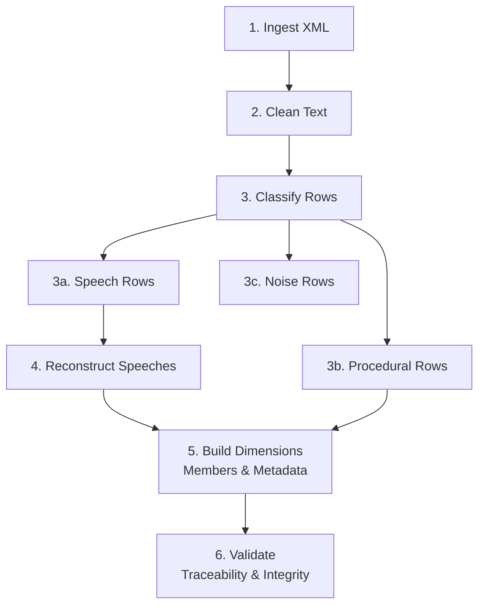

# Senedd Speech Reconstruction Pipeline

Transform raw Senedd Cymru (Welsh Parliament) XML plenary session records into semantically reconstructed speeches with full traceability, text cleaning, and bilingual support.

## Overview

This project parses XML contributions from Senedd plenary sessions, cleans the text (HTML entities, tag removal), classifies rows (speech/procedural/noise), reconstructs multi-part speeches, and stores everything in a normalized SQLite database with complete lineage tracking.

---

## Quick Start

### Installation

```bash
# Clone repository
git clone https://github.com/yourusername/senedd-scrape
cd senedd-scrape

# Install dependencies (requires Python 3.14+)
uv sync
```

### Run the Pipeline

```bash
# Full rebuild (fresh database)
python3 main.py --mode full

# Or incremental mode (append/update existing data)
python3 main.py --mode incremental
```

This creates `senedd_records.db` with all tables populated.

---

## Database Schema

### Core Dimension Tables
- **meetings** — Plenary session metadata
- **members** — Unique speakers
- **raw_contributions** — Direct XML ingestion

### Processing Pipeline Tables
- **clean_contributions** — Text-normalized rows
- **classified_contributions** — Row type classification

### Output Tables (Primary Deliverables)
- **speeches** — Reconstructed semantic units
- **speech_parts** — Lineage mapping to XML
- **procedural_events** — Non-speech events
- **speech_embeddings** — Vector storage (empty, ready for future use)

### Additional Tables
- **sync_checkpoints** — Incremental pipeline audit trail

#### Relationships
```
Meeting (1) → (M) RawContribution
           → (M) Speech

Member (1) → (M) RawContribution
          → (M) Speech

Speech (1) → (M) SpeechPart → (1) RawContribution
```

---

## Usage Guide

### Connect to Database

**From CLI:**
```bash
sqlite3 senedd_records.db
```
### Export Data

**To CSV:**
```bash
sqlite3 -header -csv senedd_records.db \
  "SELECT speech_id, speaker_name, agenda_item_id, LENGTH(speech_text) as text_length 
   FROM speeches;" > speeches.csv
```

**To JSON:**
```bash
sqlite3 -json senedd_records.db \
  "SELECT speech_id, speaker_name, speech_text FROM speeches LIMIT 10;" > speeches.json
```

---

## Pipeline Architecture

### Six Processing Phases



### Pipeline Modes

**Full Mode** (Fresh database)
```bash
python3 main.py --mode full
python3 main.py --mode full --xml-file data/other_meeting.xml
```

**Incremental Mode** (Append/update)
```bash
python3 main.py --mode incremental
python3 main.py --mode incremental --last-sync 2026-05-01
python3 main.py --mode incremental --keep-xml  # Retain XML files
```

---

## Future Enhancements

### Ready to Implement

1. **Embeddings Layer**
   - Embed 126 speeches with sentence-transformers or OpenAI
   - Store vectors in `speech_embeddings` table (schema ready)
   - Enable semantic search and similarity queries

2. **Incremental Processing**
   - Auto-detect new meetings via Senedd API
   - Append to existing database without re-processing
   - Resumable checkpoints for fault tolerance

3. **Speaker Analytics Dashboard**
   - Contribution frequency charts
   - Speech length analysis by speaker
   - Topic tagging and discourse analysis

4. **Video Alignment**
   - Link speeches to seneddTv timestamps
   - Find exact locations in parliament recording
   - Multi-language alignment

5. **Streaming Pipeline**
   - Chunked XML parsing instead of `pd.read_xml()`
   - Batch database writes for memory efficiency
   - Support for very large files

6. **Member History Tracking**
   - Track job title changes over time
   - Add `member_history` table for temporal queries
   - Enable historical analysis

---

## License & Attribution

Built for analysis of Welsh Parliament proceedings. Senedd data used under open access terms.
